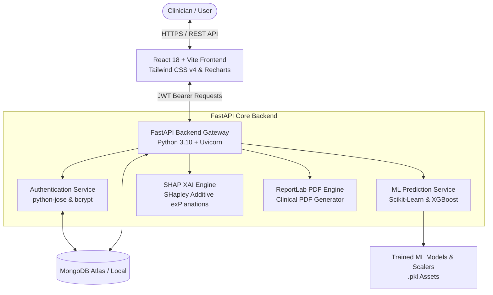

# MediVision AI 🚀

<div align="center">


> **Explainable Healthcare Intelligence & Multi-Disease Diagnostic Platform**

[](https://fastapi.tiangolo.com/)
[](https://react.dev/)
[](https://vitejs.dev/)
[](https://www.mongodb.com/)
[](https://tailwindcss.com/)
[](https://xgboost.readthedocs.io/)
[](https://shap.readthedocs.io/)
[](https://www.docker.com/)

[**Live Demo Video**](#-demo--screenshots) • [**API Docs**](docs/API_DOCUMENTATION.md) • [**Architecture**](docs/ARCHITECTURE.md) • [**Deployment Guide**](DEPLOYMENT_GUIDE.md)

</div>

---

## 📌 Project Overview

**MediVision AI** is a full-stack, machine-learning-powered healthcare diagnostic system engineered to deliver **explainable clinical predictions** across 5 medical domains. 

In clinical diagnostics, black-box AI models often fail to build trust among healthcare practitioners. MediVision AI solves this by coupling trained Machine Learning models (XGBoost, Random Forests, Scikit-Learn) with **SHAP (SHapley Additive exPlanations)**. For every prediction, clinicians receive not only a confidence risk score but also a visual, feature-by-feature breakdown of *why* the result was generated.

---

## ✨ Key Features

- 🔐 **JWT Authentication & User Security**: Secure user registration and login with `python-jose`, `bcrypt` password hashing, and unique email indexing in MongoDB.
- 🩺 **5 Multi-Disease Clinical Risk Engines**:
  - **Diabetes Risk Engine**: Glucose, Insulin, BMI, and Pedigree score analysis.
  - **Cardiovascular Risk Engine**: Resting ECG, Chest pain type, Cholesterol, and Max Heart Rate evaluation.
  - **Chronic Kidney Disease (CKD) Engine**: Serum creatinine, specific gravity, hemoglobin, and albumin metrics.
  - **Liver Function Risk Engine**: Bilirubin, SGPT/SGOT enzymes, and total proteins.
  - **Parkinson's Neurological Engine**: Vocal fundamental frequency, jitter, shimmer, and HNR analysis.
- 🧠 **Explainable AI (SHAP XAI)**: Game-theoretic SHAP feature importance charts (via Recharts) quantifying exact positive (risk-increasing) and negative (risk-decreasing) feature impacts per patient.
- 📄 **Downloadable Clinical PDF Reports**: Server-side ReportLab and client-side streaming report generators producing branded medical PDF summaries with patient inputs, predictions, confidence scores, and SHAP insights.
- 📜 **Paginated Diagnostic History**: MongoDB-backed prediction timeline linked to user accounts featuring multi-criteria search/filtering by disease type, risk status (`Positive`/`Negative`), date, and instant deletion controls.
- 🐳 **Docker & Production Deployment Ready**: Multi-container Docker Compose setup for local development, prepared for Vercel (Frontend), Render/Railway (Backend), and MongoDB Atlas (Database).

---

## 🛠️ Tech Stack

### Frontend
- **Framework**: React 18 + Vite
- **Styling**: Tailwind CSS v4 + Custom Glassmorphism UI Design System
- **Routing**: React Router v7
- **HTTP Client**: Axios with automatic Bearer token interceptor
- **Icons**: Lucide React
- **Data Visualization**: Recharts (SHAP Feature Importance Graphs)
- **Client PDF Fallback**: jsPDF

### Backend
- **Framework**: FastAPI (Python 3.10)
- **Database Engine**: MongoDB (Motor async driver + PyMongo + AsyncMongoMockClient fallback)
- **Security**: JWT Authentication (`python-jose`) & `bcrypt` password hashing
- **Machine Learning**: Scikit-Learn, XGBoost, Pandas, NumPy, Joblib
- **Explainable AI**: SHAP (SHapley Additive exPlanations)
- **PDF Generation**: ReportLab PDF Engine
- **Test Suite**: Async HTTPX integration test suite

---

## 🏗️ Project Architecture



For complete architectural sequence diagrams, check [docs/ARCHITECTURE.md](docs/ARCHITECTURE.md).

---

## 📂 Folder Structure

```text
MediVision-AI/
├── backend/
│   ├── app/
│   │   ├── api/                  # FastAPI REST Route Controllers
│   │   ├── auth/                 # JWT & bcrypt Security Module
│   │   ├── core/                 # App Settings & Environment config
│   │   ├── database/             # MongoDB Motor async client
│   │   ├── ml/                   # Model Training Pipelines per disease
│   │   ├── schemas/              # Pydantic Request/Response Models
│   │   ├── services/             # Prediction, SHAP, & PDF Services
│   │   └── main.py               # FastAPI App Entrypoint
│   ├── trained_models/           # Pickled ML models & scalers (.pkl)
│   ├── tests/                    # Integration & Unit Test Suite
│   ├── Dockerfile                # Backend Docker container configuration
│   └── requirements.txt          # Python dependencies
├── frontend/
│   ├── src/
│   │   ├── api/                  # Axios HTTP client with JWT interceptor
│   │   ├── components/           # Reusable UI (Navbar, Footer, ShapChart)
│   │   ├── context/              # React AuthContext state provider
│   │   ├── pages/                # Page views (Dashboard, Login, History)
│   │   │   └── predict/          # Disease Prediction Form Components
│   │   └── utils/                # PDF Report Generator
│   ├── Dockerfile                # Multi-stage Frontend Dockerfile
│   └── vercel.json               # Vercel SPA deployment rewrites
├── datasets/                     # Raw CSV Clinical Datasets
├── docs/                         # Detailed Architecture & Technical Manuals
├── docker-compose.yml            # Local Multi-Container Orchestration
├── render.yaml                   # Render Cloud Blueprint
└── DEPLOYMENT_GUIDE.md           # Step-by-step Production Deployment Guide
```

---

## 🚀 Installation & Running Locally

### Option A: Running with Docker Compose (Recommended)

```bash
# Clone the repository
git clone https://github.com/iotalord21/MediVision-AI.git
cd MediVision-AI

# Launch all 3 services (Frontend, Backend, MongoDB)
docker-compose up --build
```
- **Frontend App**: `http://localhost`
- **FastAPI Backend Swagger**: `http://localhost:8000/docs`

---

### Option B: Native Local Setup

#### 1. Prerequisites
- Python 3.10+
- Node.js 18+
- MongoDB instance (Local or MongoDB Atlas)

#### 2. Backend Setup
```bash
cd backend
python -m venv venv
# On Windows:
.\venv\Scripts\activate
# On Linux/macOS:
source venv/bin/activate

pip install -r requirements.txt
uvicorn app.main:app --reload
```
API Documentation will be live at `http://127.0.0.1:8000/docs`.

#### 3. Frontend Setup
```bash
cd frontend
npm install
npm run dev
```
Frontend web application will be running at `http://localhost:5173`.

---

## 🔐 Environment Variables

### Backend (`backend/.env`)
```env
MONGODB_URL=mongodb://localhost:27017
DATABASE_NAME=medivision_ai
SECRET_KEY=your_secure_random_jwt_secret_key
ALGORITHM=HS256
ACCESS_TOKEN_EXPIRE_MINUTES=60
```

### Frontend (`frontend/.env`)
```env
VITE_API_BASE_URL=http://127.0.0.1:8000/api/v1
```

---

## 🤖 Model Information & Performance Summary

| Diagnostic Engine | Primary Algorithm | Scaler | Features | Primary Metrics | SHAP Engine |
| :--- | :--- | :--- | :--- | :--- | :--- |
| **Diabetes** | XGBoost Classifier | StandardScaler | 8 Metabolic Parameters | Accuracy, ROC-AUC, F1 | TreeSHAP |
| **Cardiovascular** | Random Forest | StandardScaler | 13 Clinical Parameters | Accuracy, Sensitivity, ROC-AUC | TreeSHAP |
| **Kidney (CKD)** | XGBoost Classifier | RobustScaler | 24 Renal Parameters | Accuracy, Precision, Recall | TreeSHAP |
| **Liver Function** | Random Forest | StandardScaler | 10 Hepatic Parameters | Accuracy, F1-Score | TreeSHAP |
| **Parkinson's** | XGBoost Classifier | MinMaxScaler | 22 Vocal Acoustic Parameters | Accuracy, ROC-AUC | TreeSHAP |

For detailed datasets, feature mappings, and preprocessing steps, read [docs/MODEL_DOCUMENTATION.md](docs/MODEL_DOCUMENTATION.md).

---

## 🧠 Explainable AI (SHAP)

MediVision AI computes SHAP values based on coalitional game theory:

$$\phi_i = \sum_{S \subseteq F \setminus \{i\}} \frac{|S|!(|F| - |S| - 1)!}{|F|!} \left[ f(S \cup \{i\}) - f(S) \right]$$

Each prediction returns feature importances categorized as:
- **`positive` impact (Red)**: Increases patient disease risk probability.
- **`negative` impact (Green)**: Decreases patient disease risk probability.

---

## 📸 Screenshots & Demo

| Glassmorphic Dashboard | SHAP XAI Visualizer |
| :---: | :---: |
|  |  |

| Diagnostic History Timeline | Branded PDF Summary Report |
| :---: | :---: |
|  |  |

---

## 📚 Complete Technical Documentation

- 📐 [**System Architecture Specs**](docs/ARCHITECTURE.md)
- 📡 [**REST API Documentation**](docs/API_DOCUMENTATION.md)
- 🗄️ [**MongoDB Database Schema**](docs/DATABASE_DOCUMENTATION.md)
- 🤖 [**Machine Learning Model Specs**](docs/MODEL_DOCUMENTATION.md)
- 🚀 [**Production Deployment Guide**](DEPLOYMENT_GUIDE.md)
- 📖 [**User Guide & Manual**](docs/USER_GUIDE.md)
- 🛠️ [**Developer Onboarding Guide**](docs/DEVELOPER_GUIDE.md)

---

## 🔮 Future Scope

- 📱 **Mobile App (React Native)**: Native iOS & Android clinical mobile app companion.
- 🖼️ **Medical Imaging (DICOM / CNNs)**: Chest X-Ray pneumonia and MRI brain tumor segmentation modules.
- 🌐 **FHIR & HL7 Integration**: Standardized Electronic Health Record (EHR) data import.

---

## 👤 Contributors & Author

- **Gopal** ([@iotalord21](https://github.com/iotalord21)) — Lead Developer & ML Engineer

---

## 📝 License

This project is open-source under the [MIT License](LICENSE).
