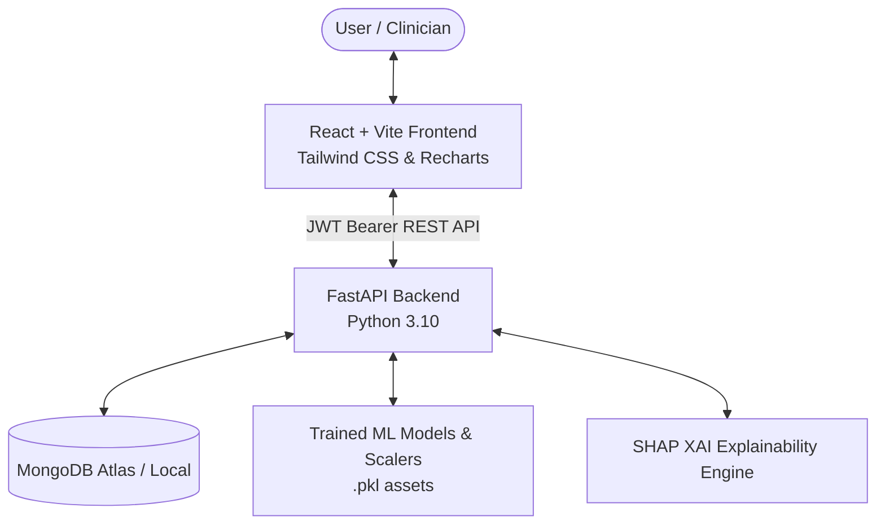

# MediVision AI 🚀

> **Explainable Healthcare Disease Prediction & Intelligence Platform**

MediVision AI is a full-stack, machine-learning-powered healthcare diagnostic system. It leverages trained Machine Learning models (XGBoost, Scikit-Learn, Random Forests) combined with **SHAP (SHapley Additive exPlanations) Explainable AI**, JWT Authentication, prediction history logging in MongoDB, and downloadable PDF clinical summary reports.

---

## 🌟 Key Features

- 🔐 **JWT Authentication & User Management**: Secure registration & login powered by `python-jose`, `bcrypt`, and MongoDB unique email indexing.
- 🩺 **Multi-Disease Clinical AI Models**:
  - **Diabetes Risk Engine**: Glucose, Insulin, BMI, Pedigree score evaluation.
  - **Cardiovascular Risk Engine**: Resting ECG, Chest pain, Cholesterol, Max Heart Rate analysis.
  - **Chronic Kidney Disease (CKD) Engine**: Serum creatinine, specific gravity, hemoglobin metrics.
  - **Liver Function Risk Engine**: Bilirubin, SGPT/SGOT enzymes, total proteins.
  - **Parkinson's Neurological Engine**: Vocal fundamental frequency, jitter, shimmer, HNR analysis.
- 🧠 **SHAP Explainable AI**: Visual feature importance breakdown (Recharts) for every prediction to explain *why* a positive/negative result was generated.
- 📄 **PDF Medical Report Generator**: One-click download of branded clinical summaries using `jsPDF`.
- 📜 **Diagnostic Prediction History**: Saved prediction timeline in MongoDB linked to authenticated user accounts with search, filter, and delete controls.
- 🐳 **Dockerized Container Architecture**: Multi-stage build setup for local development & deployment.

---

## 🏗️ Architecture Overview



---

## 🛠️ Tech Stack

### Frontend
- **Framework**: React 18 + Vite
- **Styling**: Tailwind CSS v4 + Glassmorphism UI Design
- **Routing**: React Router v7
- **HTTP Client**: Axios with Bearer token interceptor
- **Icons**: Lucide React
- **Data Visualization**: Recharts (SHAP Feature Importance Graphs)
- **PDF Generation**: jsPDF + html2canvas

### Backend
- **Framework**: FastAPI (Python 3.10)
- **Database**: MongoDB (Motor async client + PyMongo)
- **Authentication**: JWT (`python-jose`), `bcrypt` password hashing
- **Machine Learning**: Scikit-Learn, XGBoost, Pandas, NumPy, Joblib
- **Explainable AI**: SHAP (SHapley Additive exPlanations)
- **Testing**: Async HTTPX integration test suite

---

## 🚀 Quick Start Guide

### 1. Prerequisites
- Python 3.10+
- Node.js 18+
- MongoDB instance (Local or MongoDB Atlas)

### 2. Backend Setup
```bash
cd backend
python -m venv venv
.\venv\Scripts\activate
pip install -r requirements.txt
python -m uvicorn app.main:app --reload
```
API Documentation will be available at:
- Swagger UI: `http://127.0.0.1:8000/docs`
- Health Endpoint: `http://127.0.0.1:8000/health`

### 3. Frontend Setup
```bash
cd frontend
npm install
npm run dev
```
Frontend web application will be running at `http://localhost:5173`.

---

## 🐳 Running with Docker Compose

```bash
docker-compose up --build
```
- Frontend: `http://localhost`
- Backend API: `http://localhost:8000`
- MongoDB: `mongodb://localhost:27017`

---

## 🧪 Running Automated Tests

```bash
cd backend
$env:PYTHONPATH="."
.\venv\Scripts\python.exe tests/test_all.py
```

---

## 📝 License
This project is open source and available under the MIT License.
