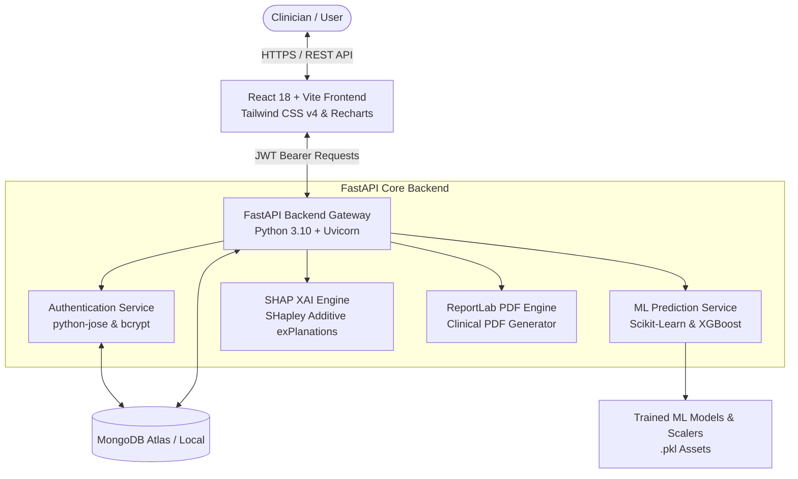
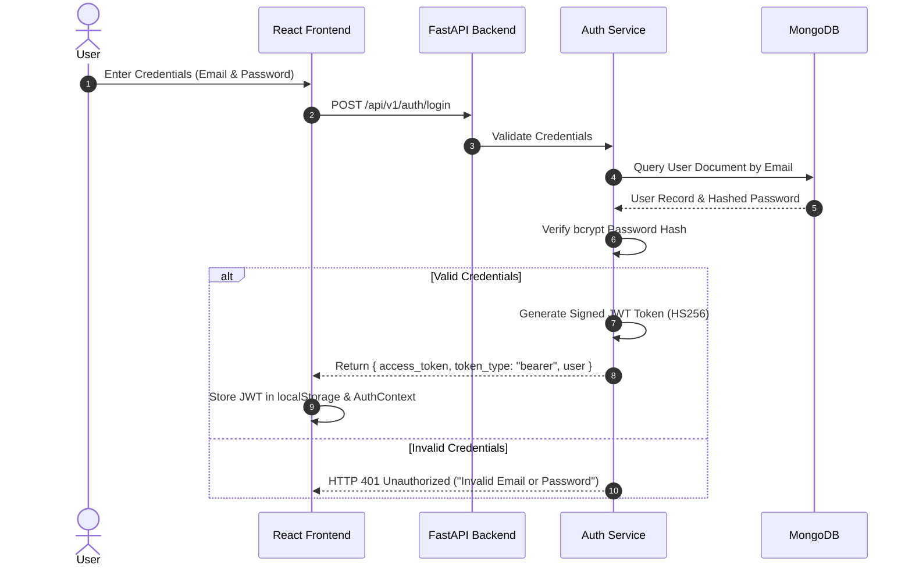
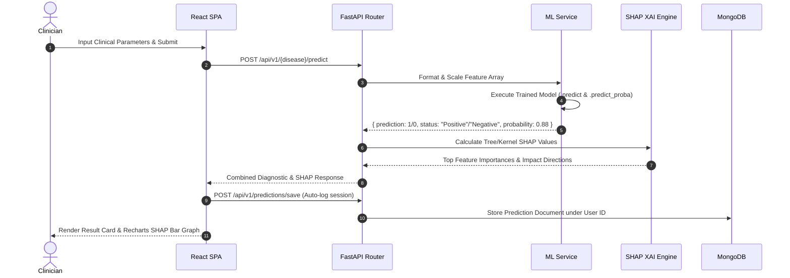
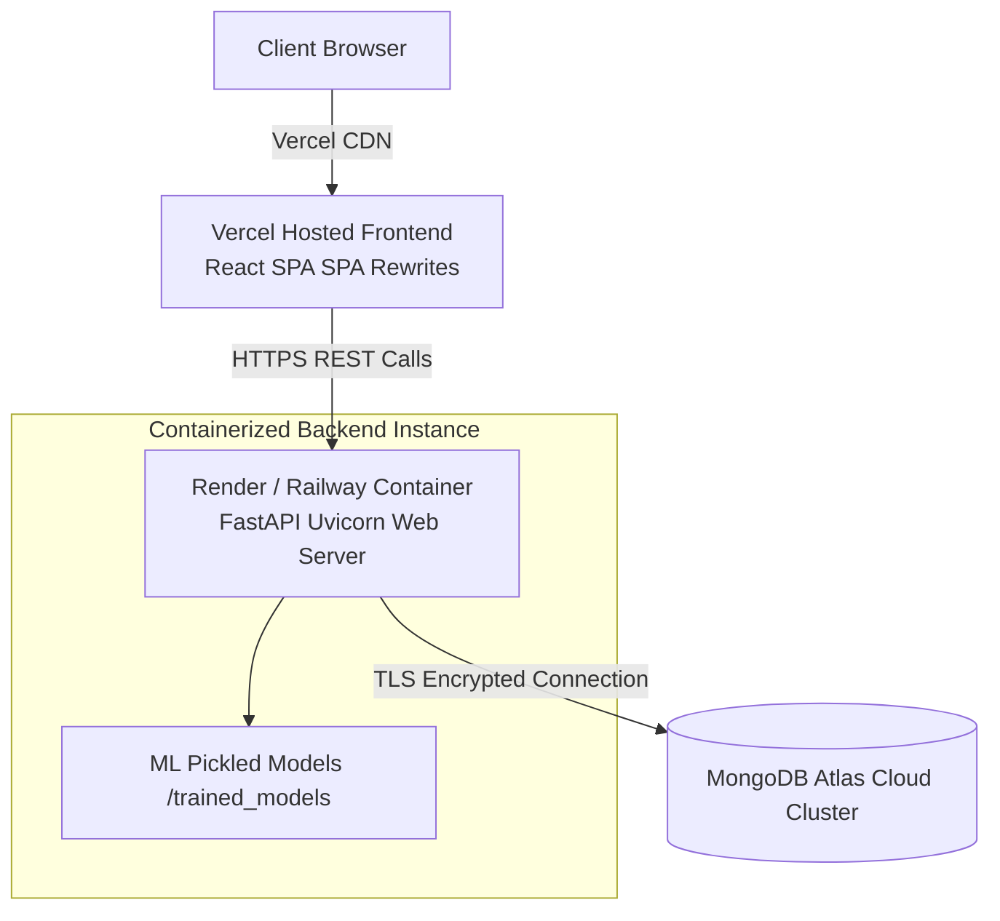

# 🏗️ System Architecture & Workflow Specifications

This document outlines the system topology, component interactions, security flows, and execution pipelines for **MediVision AI**.

---

## 📐 High-Level Architecture Overview



---

## 🔐 1. Authentication & Security Flow

MediVision AI uses stateless **JWT (JSON Web Tokens)** with password hashing powered by `bcrypt`.



---

## 🩺 2. Diagnostic Prediction Execution Flow



---

## 🧠 3. SHAP Explainable AI (XAI) Workflow

```mermaid
graph LR
    Input[Raw Clinical Features] --> Preprocess[Feature Standard Scaling & Encoding]
    Preprocess --> Model[Trained Ensemble Model\nXGBoost / Random Forest]
    Model --> Prob[Prediction Probability Score]
    
    Preprocess --> SHAPExplainer[Tree/Kernel SHAP Explainer]
    Model --> SHAPExplainer
    SHAPExplainer --> BaseVal[Base Value / Expected Output]
    SHAPExplainer --> Values[Individual Feature SHAP Values]
    
    Values --> Sort[Sort Features by |SHAP Value|]
    Sort --> Categorize[Classify Impact: Positive (+ Risk) / Negative (- Risk)]
    Categorize --> JSON[JSON Feature Contribution Response]
    JSON --> Recharts[Interactive Recharts Visualization]
```

---

## 🐳 4. Deployment Environment Topology


