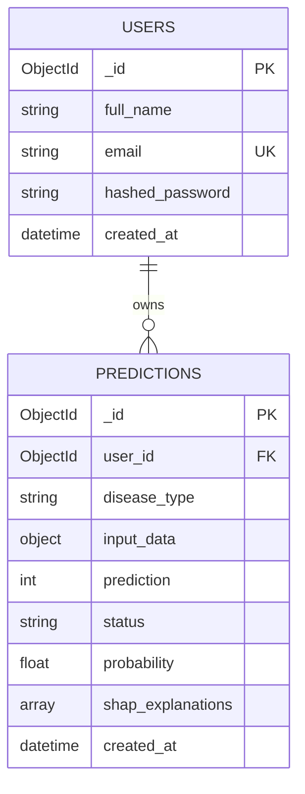

# 🗄️ Database Architecture & MongoDB Schemas

MediVision AI utilizes **MongoDB** (via Motor async driver & PyMongo) for data persistence.

---

## 📚 Database Summary

- **Database Name**: `medivision_ai`
- **Driver**: `motor.motor_asyncio.AsyncIOMotorClient`
- **Fallback Motor Engine**: `mongomock_motor.AsyncMongoMockClient` (for offline testing & local validation)

---

## 📑 1. `users` Collection Schema

Stores authenticated user accounts.

```json
{
  "_id": { "$oid": "669b3f81e8c9b2a14d5e7f90" },
  "full_name": "Dr. Sarah Connor",
  "email": "sarah.connor@hospital.org",
  "hashed_password": "$2b$12$eImiTXuWVxfM37uY4JANjO5E.dE5F.zG9p0L3mN7K8j1P2q3R4s5T6",
  "created_at": { "$date": "2026-07-21T07:33:00.000Z" }
}
```

### Collection Indexes:
| Index Name | Key(s) | Type | Purpose |
| :--- | :--- | :--- | :--- |
| `_id_` | `_id: 1` | Primary | Default MongoDB BSON ObjectId. |
| `email_1` | `email: 1` | Unique | Enforces unique email registration & speeds up login queries. |

---

## 📜 2. `predictions` Collection Schema

Stores historical disease diagnostic evaluations, input parameters, ML probability scores, and SHAP XAI feature importances.

```json
{
  "_id": { "$oid": "669b4002e8c9b2a14d5e7f95" },
  "user_id": { "$oid": "669b3f81e8c9b2a14d5e7f90" },
  "disease_type": "diabetes",
  "disease": "diabetes",
  "input_data": {
    "pregnancies": 2,
    "glucose": 140.0,
    "blood_pressure": 70.0,
    "skin_thickness": 20.0,
    "insulin": 80.0,
    "bmi": 28.5,
    "diabetes_pedigree_function": 0.52,
    "age": 35
  },
  "prediction": 1,
  "status": "Positive",
  "probability": 0.74,
  "shap_explanations": [
    {
      "feature_name": "Glucose",
      "feature_value": 140.0,
      "shap_value": 32.89,
      "impact": "positive"
    },
    {
      "feature_name": "BMI",
      "feature_value": 28.5,
      "shap_value": 4.12,
      "impact": "positive"
    }
  ],
  "created_at": { "$date": "2026-07-21T13:00:00.000Z" }
}
```

### Collection Indexes:
| Index Name | Key(s) | Type | Purpose |
| :--- | :--- | :--- | :--- |
| `user_id_1_created_at_-1` | `user_id: 1, created_at: -1` | Compound | Fast paginated history retrieval sorted by date. |
| `user_id_1_disease_type_1` | `user_id: 1, disease_type: 1` | Compound | Efficient filtering by specific disease engine. |
| `user_id_1_status_1` | `user_id: 1, status: 1` | Compound | Fast filtering by risk status (`Positive`/`Negative`). |

---

## 🔗 Data Relationships


