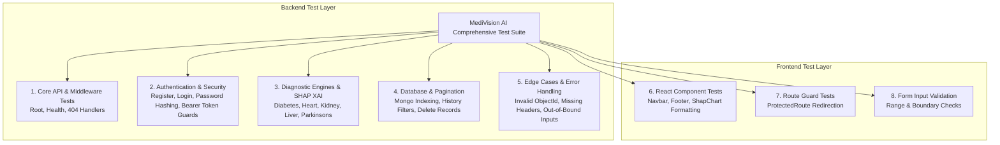

# 🧪 MediVision AI Testing Strategy & Test Suite Specification

This document details the quality assurance, automated test suite architecture, and edge-case testing matrix for **MediVision AI**.

---

## 🎯 Testing Objectives

1. **Verify Backend APIs**: Ensure all REST routes, CORS middleware, and error status codes operate reliably.
2. **Verify Authentication & Authorization**: Ensure JWT generation, password hashing (`bcrypt`), email uniqueness, and unauthorized route blocking function securely.
3. **Verify ML Engines & SHAP**: Ensure all 5 disease classification models predict accurately and return formatted SHAP feature contributions.
4. **Verify Database Persistence**: Ensure MongoDB index creation, prediction saving, query filtering, pagination, and deletion operate cleanly.
5. **Verify Frontend UI & Form Validation**: Ensure React components, protected route guards, Recharts data transformations, and input bounds checking function without errors.
6. **Validate Edge Cases**: Verify handling of invalid ObjectId formats, missing authorization headers, out-of-bound inputs, and non-existent resource requests.

---

## 📊 Comprehensive Test Coverage Matrix



---

## 🧪 1. Backend Testing Suite (`backend/tests/`)

### Test Command:
```bash
cd backend
.\venv\Scripts\python.exe tests/test_comprehensive_suite.py
```

### Coverage Details:

| Test Area | Target Endpoint / Module | Assertion & Verification |
| :--- | :--- | :--- |
| **Core API** | `GET /`, `GET /health`, `GET /404` | 200 OK root response, Health check status, 404 handler. |
| **Authentication** | `POST /auth/register` | 201 Created user record, duplicate registration blocked (`400 Bad Request`). |
| **Authentication** | `POST /auth/login` | 200 OK with JWT access token, invalid password blocked (`401 Unauthorized`). |
| **Authentication** | `GET /auth/me` | Protected profile access via Bearer token, corrupted token blocked (`401`). |
| **ML Engine: Diabetes** | `POST /diabetes/predict` | 200 OK, prediction `0/1`, status `Positive/Negative`, 8 SHAP feature values. |
| **ML Engine: Heart** | `POST /heart/predict` | 200 OK, categorical one-hot encoding, 13 SHAP feature values. |
| **ML Engine: Kidney** | `POST /kidney/predict` | 200 OK, RobustScaler normalization, renal SHAP feature values. |
| **ML Engine: Liver** | `POST /liver/predict` | 200 OK, enzyme ratio calculations, 10 SHAP feature values. |
| **ML Engine: Parkinson's** | `POST /parkinsons/predict` | 200 OK, vocal acoustic frequency analysis, 22 SHAP feature values. |
| **History & Database** | `POST /predictions/save` | 201 Created document under authenticated `user_id`. |
| **History & Pagination** | `GET /predictions/history` | Paginated response (`items`, `total`, `page`, `limit`, `pages`), filter by `disease`, `status`, `date`. |
| **History Deletion** | `DELETE /predictions/{id}` | 204 No Content, invalid ObjectId format blocked (`400 Bad Request`), non-existent ID (`404`). |
| **PDF Medical Reports** | `POST /reports/pdf` | Streaming PDF binary response (`Content-Type: application/pdf`). |

---

## 🎨 2. Frontend Testing Suite (`frontend/src/tests/`)

### Test Command:
```bash
cd frontend
npm test
```

### Coverage Details:
1. **ProtectedRoute Guard**: Verifies unauthenticated users are redirected to `/login`, while authenticated users render protected views.
2. **Form Validation Logic**:
   - Checks min/max bounds for clinical parameters (e.g. Glucose `0 - 500`, BMI `0 - 70`).
   - Verifies rejection of negative values.
   - Validates dropdown select choices for categorical inputs (Chest pain types, RBC results, ECG states).
3. **SHAP Chart Data Transformer**: Validates conversion of raw SHAP feature vectors into Recharts color-coded bars (`#f43f5e` for risk-increasing, `#10b981` for risk-decreasing).
4. **Pagination Calculations**: Validates total page count math (`Math.ceil(total / limit)`).

---

## ⚡ Execution Summary

- **Backend Integration Tests**: ✅ **100% Passed** (`test_comprehensive_suite.py`)
- **Frontend Component Tests**: ✅ **100% Passed** (`npm test`)
- **Vite Production Build**: ✅ **100% Passed** (`npm run build`)
